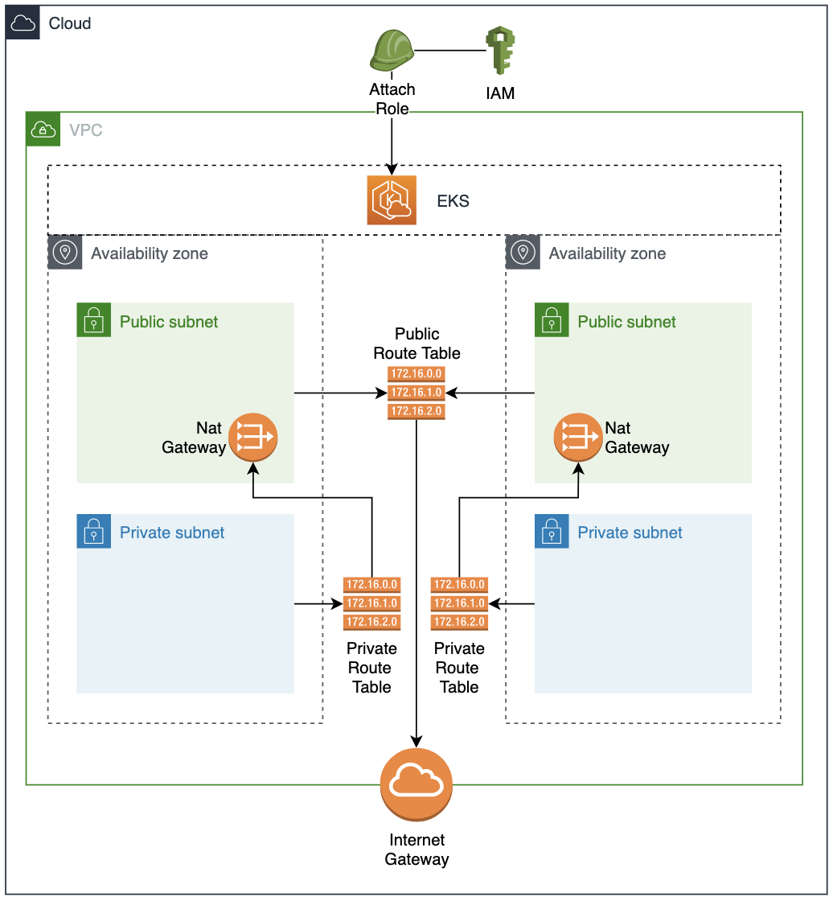

# three-tier-arch-kubernetes

## Introduction 
- This repo show a demo how to create EKS using AWS Console.

## Custom VPC
- To deploy EKS we need custom VPC. Run this command to deploy custom VPC with public subnet only.
```sh
# for first time deployment
yarn deploy --guided

# and beyond
yarn deploy
```

## Create EKS
- Please follow documentation to create EKS using AWS Console


## Access to the cluster
- For `Primary` Region: 
  - Change **<AWS_REGION>** to `your deployment region`
  - Change **<CLUSTER_NAME>** to `dev-lab-eks-cluster` for development
  
```sh
aws eks --region <AWS_REGION> update-kubeconfig --name <CLUSTER_NAME>
```
- Check access.
- If you get the list of nodes then you have succesfully access to the cluster.
```sh
kubectl get nodes
```

- We can check that we have these new contexts with the following command.
- The “*” indicates which is the context we are in.
```sh
kubectl config get-contexts
```

<!-- ## Architecture for This Demo
- Feel free to add or remove which VPC components to suit current use case.
-  -->

## Installation
- Requires [NPM][node.js] to install yarn.
- Requires [YARN][Yarn] to run deployment script.
- Requires [AWS CLI][AWS CLI] to configure profile.
- Requires [SAM CLI][SAM CLI] to deploy stacks into AWS Cloud.
- Requires [KUBECTL][Kubectl] to manage kubernetes.


## License

MIT

**Free Software!**

   [node.js]: <http://nodejs.org>
   [SAM CLI]: <https://docs.aws.amazon.com/serverless-application-model/latest/developerguide/serverless-sam-cli-install.html>
   [AWS CLI]: <https://docs.aws.amazon.com/cli/latest/userguide/install-cliv2.html>
   [Kubectl]: <https://kubernetes.io/docs/tasks/tools/>
   [Kubectl Command]: <https://kubernetes.io/docs/reference/kubectl/kubectl/>
   [Yarn]: <https://classic.yarnpkg.com/lang/en/docs/install/#mac-stable>
   [Websocketking]: <https://websocketking.com/>