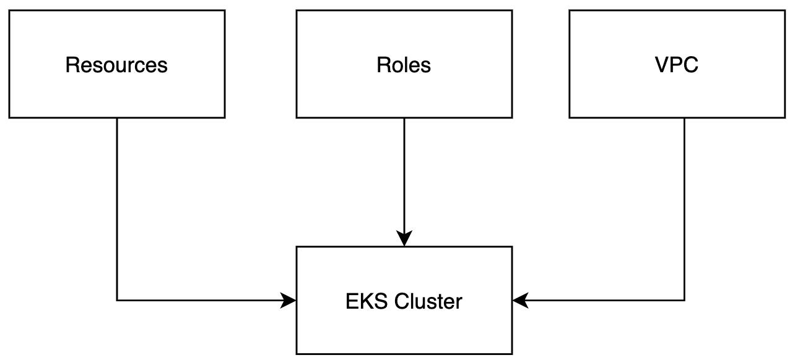

# three-tier-arch-kubernetes

## Introduction 
- This repo contain basic example of **AWS Elastic Kubernetes Service (EKS)** deploy by using **SAM**. 
- Feel free to explore the code at your own risk. :stuck_out_tongue_winking_eye:

## Stacks
- There are 3 stacks used in this template `VPC`, `Roles`, and `EKS Cluster`.
- 

## Architecture
- Feel free to add or remove which VPC components to suit current use case.
- 

## Installation
- Requires [NPM][node.js] to install yarn.
- Requires [YARN][Yarn] to run deployment script.
- Requires [AWS CLI][AWS CLI] to configure profile.
- Requires [SAM CLI][SAM CLI] to deploy stacks into AWS Cloud.
- Requires [KUBECTL][Kubectl] to manage kubernetes.

For development deployment you can run script that execute sam cli
```sh
yarn maedev
```
For production deployment you can run script that execute sam cli
```sh
yarn maeprod
```


## License

MIT

**Free Software, Syukran Alhamdulillah Thank to Allah!**

   [node.js]: <http://nodejs.org>
   [SAM CLI]: <https://docs.aws.amazon.com/serverless-application-model/latest/developerguide/serverless-sam-cli-install.html>
   [AWS CLI]: <https://docs.aws.amazon.com/cli/latest/userguide/install-cliv2.html>
   [Kubectl]: <https://kubernetes.io/docs/tasks/tools/>
   [Kubectl Command]: <https://kubernetes.io/docs/reference/kubectl/kubectl/>
   [Yarn]: <https://classic.yarnpkg.com/lang/en/docs/install/#mac-stable>
   [Websocketking]: <https://websocketking.com/>